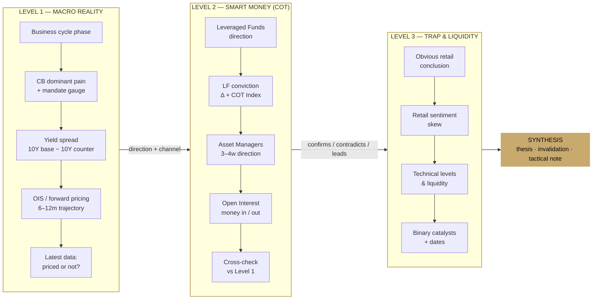
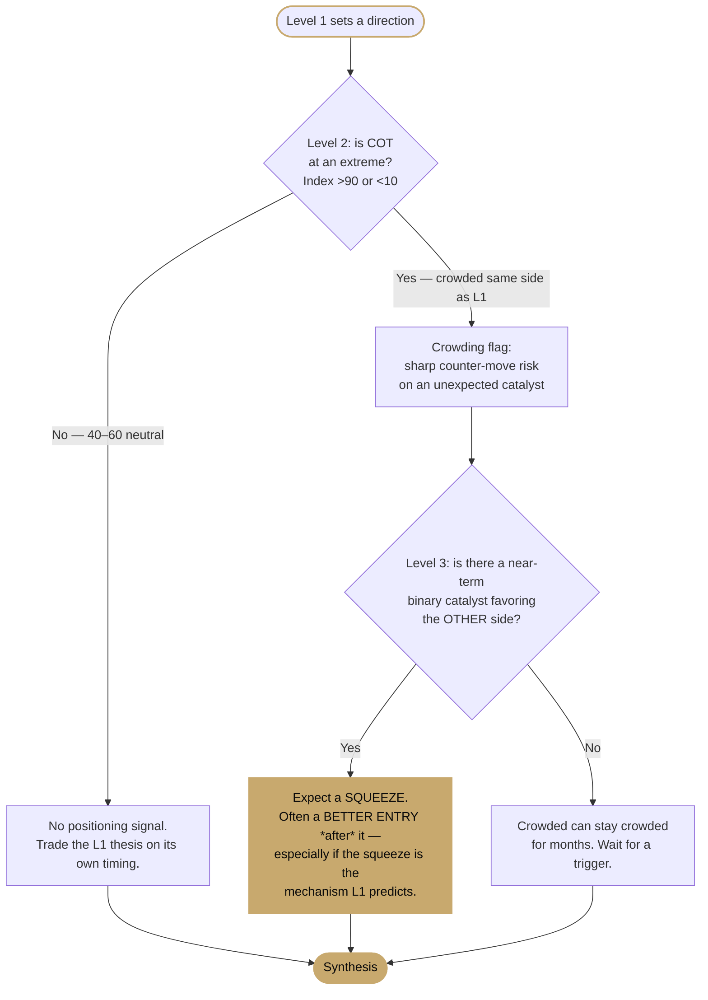
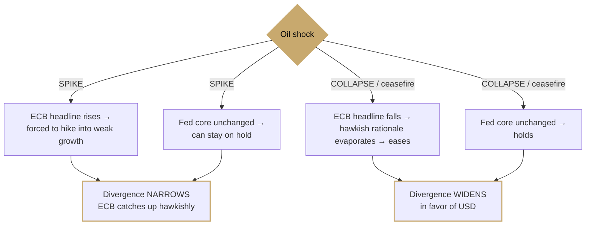

# Macro AI Agent for Claude

> A structured, institutional-grade analysis framework for macro-driven FX trading — packaged as a [Claude Agent Skill](https://docs.claude.com).

Every FX analysis flows through **three sequential levels**. No level concludes alone: each one confirms, contradicts, or adds nuance to the previous. The framework forces the question retail analysis skips — not *what* the trade is, but *how* the macro transmits into price, *when* the effect exhausts, and *what specifically* would break the thesis.


---

## The pipeline at a glance



**Core rule of sequence:** Level 1 sets the structural (weeks–months) thesis. Levels 2 and 3 modify *timing and risk* — they never replace the thesis. A crowded COT position or an "obvious" retail narrative adjusts *how and when* to act, not *whether* the Level 1 read is correct.

---

## How the levels interact (decision logic)

The value isn't in the three boxes — it's in what each level does to the one before it. The two highest-leverage interactions:



### The crux: the mandate-gauge asymmetry

The single idea that separates this framework from "ECB dovish, Fed hawkish → short EUR": **the same shock transmits differently because each central bank targets a different inflation gauge.**

- **Fed → core PCE** (strips energy/food). An oil move barely touches its reaction function.
- **ECB → headline HICP** (includes energy). Oil feeds straight in.



Counterintuitive result: a structural **USD-bullish / EUR-bearish** thesis can be *stronger in the oil-collapse scenario* than in the oil-spike scenario — because of which gauge each bank is bound to. Full channel-by-channel logic in [`references/transmission-mechanics.md`](references/transmission-mechanics.md).

---

## What each level produces

| Level | Inputs | Output |
|---|---|---|
| **1 — Macro Reality** | Cycle phase, CB pain + mandate gauge, yield spread, OIS trajectory, latest data | Direction **+ which channel** it transmits through (rate differential / risk-flow / trade balance) |
| **2 — Smart Money (COT)** | TFF report: LF direction & conviction, AM, Open Interest | **Confirms / contradicts / leads** the L1 thesis, plus an explicit crowding flag |
| **3 — Trap & Liquidity** | Retail conclusion, sentiment skew, technical levels, binary catalysts | Whether liquidity & crowd **align or oppose**; a dated list of triggers |
| **Synthesis** | All of the above | Thesis · **structural invalidation** (a data event, not a price level) · tactical note |

---

## Installation

This is a Claude Agent Skill — a folder containing a `SKILL.md` plus reference files that Claude loads on demand.

```bash
git clone https://github.com/akirraUa/macro-fx-pipeline.git
```

Then place the `macro-fx-pipeline/` folder into the skills directory your Claude setup reads (e.g. your Claude Code / Agent skills path). Claude triggers it automatically whenever you ask to analyze a pair, read a COT report, or evaluate a macro thesis — no manual invocation needed.

The skill is self-contained:

```
macro-fx-pipeline/
├── SKILL.md                          # the framework + when-to-trigger logic
└── references/
    ├── cot-reading.md                # TFF method, COT Index, worked patterns
    └── transmission-mechanics.md     # channel-by-channel macro→price logic
```

---

## Usage examples

Anything that matches the trigger conditions activates the pipeline:

- `"What do you think about EUR/USD here?"` → full three-level analysis
- `"Read this COT for me: [data]"` → Level 2 only, flagged as one input to the full picture
- `"How does an oil ceasefire hit EUR/USD?"` → transmission-channel reasoning
- `"Is my short EUR/USD thesis still valid after this NFP?"` → checks the print against the structural invalidation, separates priced-in from new

The output stays tight and opinionated — concrete numbers, concrete invalidation conditions, no hedged filler.

---

## Design principles

- **Sequence matters.** Always L1 → L2 → L3. Positioning and narrative are modifiers, not standalone signals.
- **State data gaps explicitly.** If a level lacks input, the skill says exactly what's needed rather than guessing.
- **Invalidation is a macro event, not a price level.** The thesis breaks when a specific data point or CB action breaks it — not when a candle touches a line.

---

## License

[MIT](LICENSE) — use it, fork it, adapt your own levels.
